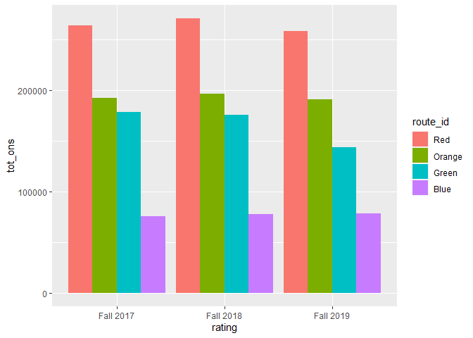
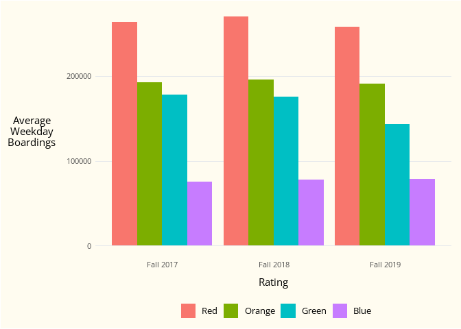
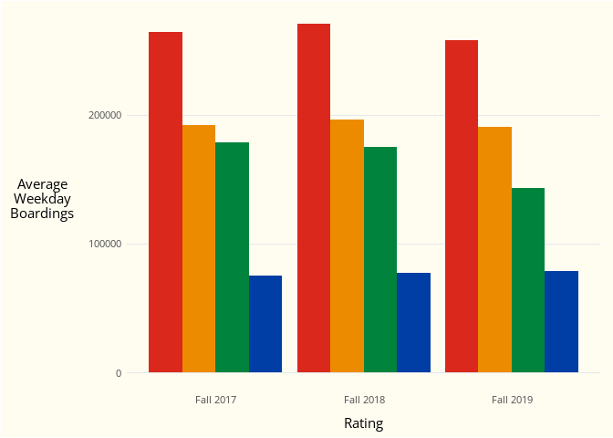

<!-- README.md is generated from README.Rmd. Please edit that file -->

# opmitools

<!-- badges: start -->
<!-- badges: end -->

`opmitools` serves 3 primary purposes:

1.  Functions for cleaning and merging GTFS files (building on
    [`tidytransit`](https://github.com/r-transit/tidytransit))
2.  Presenting data consistent with OPMI’s Office Theme (building on
    [`ggplot2`](https://ggplot2.tidyverse.org/))
    1.  This part of the package draws on “[Creating corporate colour
        palettes for
        ggplot2](https://drsimonj.svbtle.com/creating-corporate-colour-palettes-for-ggplot2)”
3.  Access to common reference tables

## Installation

You can install the development version of opmitools from
[GitHub](https://github.com/) with:

``` r
# install.packages("devtools")
devtools::install_github("kmeakinmbta/opmitools")
```

And load/attach opmitools as you would any other package with:

``` r
library(opmitools)
```

## Usage

### GTFS Files

Read the current MBTA GTFS from [mbta.com](https://www.mbta.com/) with:

``` r
mbta_gtfs <- read_mbta_gtfs()
```

`read_mbta_gtfs()` is a wrapper for `tidytransit::read_gtfs()`. It
stores the individual tables in a list and enforces column types as
specified in the GTFS standard.

For some downstream trip planners and other applications, it is
useful/necessary to remove all extraneous stops, shapes, routes, and
`service_id`s (i.e., those that are not used in the either `trips.txt`
or `stop_times.txt`). You can check for extraneous components with
`gtfs_removal_check()`:

``` r
gtfs_removal_check(mbta_gtfs)
#> $routes_unused
#> # A tibble: 48 x 13
#>    route_id   agency_id route_short_name route_long_name   route_desc route_type
#>    <chr>      <chr>     <chr>            <chr>             <chr>           <int>
#>  1 CR-Foxboro 1         ""               Foxboro Event Se~ Commuter ~          2
#>  2 72         1         "72"             Aberdeen Avenue ~ Local Bus           3
#>  3 79         1         "79"             Arlington Height~ Local Bus           3
#>  4 84         1         "84"             Arlmont Village ~ Commuter ~          3
#>  5 136        1         "136"            Reading Depot - ~ Local Bus           3
#>  6 170        1         "170"            Waltham Center -~ Commuter ~          3
#>  7 195        1         "195"            Lemuel Shattuck ~ Supplemen~          3
#>  8 212        1         "212"            Quincy Center St~ Commuter ~          3
#>  9 214        1         "214"            Germantown - Qui~ Local Bus           3
#> 10 221        1         "221"            Fort Point - Qui~ Commuter ~          3
#> # ... with 38 more rows, and 7 more variables: route_url <chr>,
#> #   route_color <chr>, route_text_color <chr>, route_sort_order <int>,
#> #   route_fare_class <chr>, line_id <chr>, listed_route <chr>
#> 
#> $stops_unused
#> # A tibble: 2,366 x 19
#>    stop_id stop_code stop_name stop_desc platform_code stop_lat stop_lon zone_id
#>    <chr>   <chr>     <chr>     <chr>     <chr>            <dbl>    <dbl> <chr>  
#>  1 31258   "31258"   88 Black~ "88 Blac~ ""                42.3    -71.0 ""     
#>  2 place-~ ""        Wareham ~ ""        ""                41.8    -70.7 "CF-zo~
#>  3 CM-049~ ""        Wareham ~ "Wareham~ "1"               41.8    -70.7 "CF-zo~
#>  4 place-~ ""        Buzzards~ ""        ""                41.7    -70.6 "CF-zo~
#>  5 CM-054~ ""        Buzzards~ "Buzzard~ "1"               41.7    -70.6 "CF-zo~
#>  6 place-~ ""        Bourne    ""        ""                41.7    -70.6 "CF-zo~
#>  7 CM-056~ ""        Bourne    "Bourne ~ "1"               41.7    -70.6 "CF-zo~
#>  8 place-~ ""        Hyannis   ""        ""                41.7    -70.3 "CF-zo~
#>  9 CM-079~ ""        Hyannis   "Hyannis~ "1"               41.7    -70.3 "CF-zo~
#> 10 place-~ ""        Readville ""        ""                42.2    -71.1 "CR-zo~
#> # ... with 2,356 more rows, and 11 more variables: stop_url <chr>,
#> #   level_id <chr>, location_type <int>, parent_station <chr>,
#> #   wheelchair_boarding <int>, platform_name <chr>, stop_address <chr>,
#> #   municipality <chr>, on_street <chr>, at_street <chr>, vehicle_type <chr>
```

And remove those components with `gtfs_remove_all()`:

``` r
route_count_pre <- length(mbta_gtfs$routes$route_id)
mbta_gtfs <- gtfs_remove_all(mbta_gtfs)
route_count_post <- length(mbta_gtfs$routes$route_id)
paste0("Route count prior to removal: ", route_count_pre)
#> [1] "Route count prior to removal: 249"
paste0("Route count after removal: ", route_count_post)
#> [1] "Route count after removal: 201"
```

Other use cases might include getting some useful information out of the
`calendar.txt` file:

``` r
mbta_calendar_info <- gtfs_calendar_info(mbta_gtfs)
head(mbta_calendar_info)
#> # A tibble: 6 x 5
#>   service_id             day_type start_date end_date   totdays
#>   <chr>                  <chr>    <date>     <date>     <drtn> 
#> 1 BUS222-hba22pt1-Wdy-02 <NA>     2022-04-18 2022-04-18 1 days 
#> 2 BUS222-hba22sn1-Wdy-02 <NA>     2022-04-19 2022-04-22 4 days 
#> 3 BUS222-hbb22ns1-Wdy-02 Weekday  2022-04-18 2022-04-22 5 days 
#> 4 BUS222-hbc22ns1-Wdy-02 Weekday  2022-04-18 2022-04-22 5 days 
#> 5 BUS222-hbf22ns1-Wdy-02 Weekday  2022-04-18 2022-04-22 5 days 
#> 6 BUS222-hbg22ns1-Wdy-02 Weekday  2022-04-18 2022-04-22 5 days
```

Note that `opmitools` is not yet capable of handling GTFS-Pathways – it
is only set up to handle the required GTFS files used by the MBTA:
agency, calendar, routes, shapes, stop_times, stops, and trips. While
some functions will work without `tidytransit`, it is recommended to
install and attach `tidytransit` in conjunction with `opmitools`.

### Plotting

`opmitools` contains several convenience functions for making
“OPMI-themed” plots. As an example, we can plot information from
`rt_ridership`, which is included in the package.

The following code creates a simple ggplot showing fall average weekday
ridership on rapid transit.

``` r
library(tidyverse) # load & attach tidyverse for data wrangling with dplyr and plotting with ggplot2

(ridership_plot <-
    rt_ridership %>%  
    filter(day_type_name == "weekday") %>% 
    ggplot(aes(x = rating, y = tot_ons, fill = route_id)) +
    geom_col(position = position_dodge()))
```



Then, we can add the OPMI theme with `theme_opmi()`:

``` r
(ridership_plot <-
   ridership_plot +
   labs(x = "Rating", y = "Average\nWeekday\nBoardings") +
   theme_opmi())
```



And use colors that make sense with `scale_fill_opmi()`:

``` r
ridership_plot +
  scale_fill_opmi(palette = "rt", guide = "none")
```



### Included Data

`opmitools` contains several reference tables that may be useful,
including a table describing the MBTA service area:

``` r
head(mbta_service_area)
#> # A tibble: 6 x 3
#>   muni_name mbta65 mbta175
#>   <chr>     <lgl>  <lgl>  
#> 1 Arlington TRUE   TRUE   
#> 2 Bedford   TRUE   TRUE   
#> 3 Belmont   TRUE   TRUE   
#> 4 Beverly   TRUE   TRUE   
#> 5 Boston    TRUE   TRUE   
#> 6 Braintree TRUE   TRUE
```

And frequently used demographic information by MA block group:

``` r
head(mabgs_19)
#> # A tibble: 6 x 14
#>   GEOID          pop minopop tothh li45hh li50hh limenghh   MHHI lownocarhh
#>   <chr>        <dbl>   <dbl> <dbl>  <dbl>  <dbl>    <dbl>  <dbl>      <dbl>
#> 1 250173173012   571     231   228     38     46        0  73000       17.7
#> 2 250173531012  1270     610   327     73     73        0 132750      227. 
#> 3 250173222002  2605     290  1064    254    281       98 113800      149. 
#> 4 250251101035  1655     578   560     88     88       11 133636      220. 
#> 5 250251101032   659     501   234    113    156       30  45370       92.0
#> 6 250250603011  1452     246   700    177    193       26 130645      227. 
#> # ... with 5 more variables: foreignbornres <dbl>, minopct <dbl>,
#> #   li45pct <dbl>, li50pct <dbl>, lownocarpct <dbl>
```
